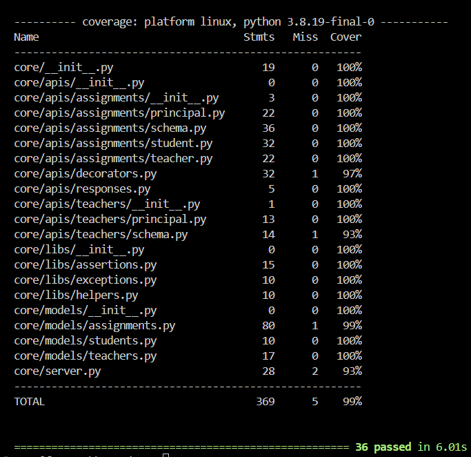

# Fyle Backend Challenge Completion

## Overview
I have completed the Fyle assignment, implementing the missing APIs and ensuring that all tests pass with a coverage of `95%`. The application has also been `Dockerized` for easier deployment.

## Postman Workspace
The implemented APIs can be tested using the following [Postman workspace URL](www.google.com)

## Completed Tasks

### Added Missing APIs ✅
I have implemented the following missing APIs:

- GET `/principal/assignments`: List all submitted and graded assignments.
- GET `/principal/teachers`: List all teachers.
- POST `/principal/assignments/grade`: Grade or re-grade an assignment.

### Resolved Bugs ✅
All intentional bugs in the application have been identified and resolved.

### Passed All Test Cases
I have ensured that all test cases pass successfully.

### Written SQL Queries
I have written the necessary SQL queries for the following:
- **count_grade_A_assignments_by_teacher_with_max_grading.sql**
- **number_of_graded_assignments_for_each_student.sql**

### Test Coverage to 95%
The test coverage has been increased to 95%, ensuring robust and reliable code.


### Dockerized the App
The application has been Dockerized, including the creation of `Dockerfile` and `docker-compose.yml` files. This simplifies the building and running of the application.

## Why work at Fyle?

Fyle is a fast-growing Expense Management SaaS product. We are ~40 strong engineering team at the moment. 

We are an extremely transparent organization. Check out our [careers page](https://careers.fylehq.com) that will give you a glimpse of what it is like to work at Fyle. Also, check out our Glassdoor reviews [here](https://www.glassdoor.co.in/Reviews/Fyle-Reviews-E1723235.htm). You can read stories from our teammates [here](https://stories.fylehq.com).


## Challenge outline

**You are allowed to use any online/AI tool such as ChatGPT, Gemini, etc. to complete the challenge. However, we expect you to fully understand the code and logic involved.**

This challenge involves writing a backend service for a classroom. The challenge is described in detail [here](./Application.md)


## What happens next?

You will hear back within 48 hours from us via email. 


## Installation

1. Fork this repository to your github account
2. Clone the forked repository and proceed with steps mentioned below

### Install requirements

```
virtualenv env --python=python3.8
source env/bin/activate
pip install -r requirements.txt
```
### Reset DB

```
export FLASK_APP=core/server.py
rm core/store.sqlite3
flask db upgrade -d core/migrations/
```
### Start Server

```
bash run.sh
```
### Run Tests

```
pytest -vvv -s tests/

# for test coverage report
# pytest --cov
# open htmlcov/index.html
```
