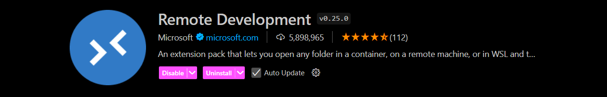
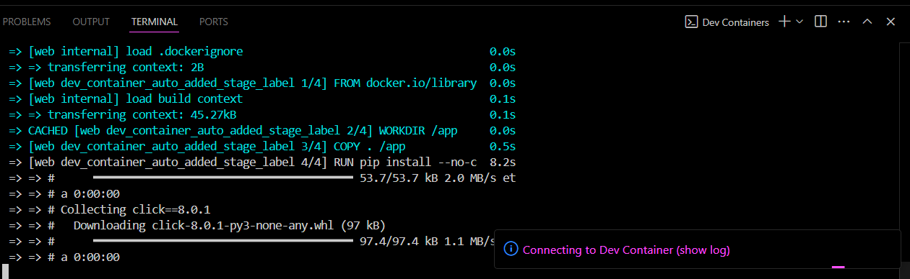

# Fyle Backend Challenge Completion

## Overview
I have completed the Fyle assignment, implementing the missing APIs and ensuring that all tests pass with a coverage of `95%`. The application has also been `Dockerized` for easier deployment.

## Postman Workspace
The implemented APIs can be tested using the following [Postman workspace URL](www.google.com)

## Completed Tasks

### 1. Added Missing APIs ✅
I have implemented the following missing APIs:

- GET `/principal/assignments`: List all submitted and graded assignments.
- GET `/principal/teachers`: List all teachers.
- POST `/principal/assignments/grade`: Grade or re-grade an assignment.

### 2. Resolved Bugs ✅
All intentional bugs in the application have been identified and resolved.

### 3. Passed All Test Cases ✅
I have ensured that all test cases pass successfully.

### 4. Written SQL Queries ✅
I have written the necessary SQL queries for the following:
- **count_grade_A_assignments_by_teacher_with_max_grading.sql**
- **number_of_graded_assignments_for_each_student.sql**

### 5. Test Coverage to 95% ✅
The test coverage has been increased to 95%, ensuring robust and reliable code.


### 6. Dockerized the App ✅
The application has been Dockerized, including the creation of `Dockerfile` and `docker-compose.yml` files. This simplifies the building and running of the application.

## Installation

1. Fork this repository to your github account
2. Clone the forked repository and proceed with steps mentioned below

### Prerequisites

1. **Docker Desktop**
   - **Windows/Mac**: Install Docker Desktop from [Docker's official website](https://www.docker.com/products/docker-desktop).
   - **Verify Installation**: Open a terminal and run:
     ```bash
     docker --version
     docker-compose --version
     ```

2. **Visual Studio Code (VSCode)**
   - Install VSCode from [Visual Studio Code's website](https://code.visualstudio.com/).

3. **VSCode Extensions**
   - **Remote - Containers**: Install this, Allows you to open a project inside a container.

   

### Setup and Build

1. **Clone the Repository**

   ```bash
   git clone https://github.com/dee077/fyle-interview-intern-backend.git
   cd fyle-interview-intern-backend
   ```

2. **Build and Start Container**

   - **Open VSCode in Development Container** : Command Palette: Press `Ctrl+Shift+P` or `Cmd+Shift+P` and then enter/select `Dev Containers: Rebuild and Reopen in container`

   - **Open Logs of the Build** : By clicking on the popup at the bottom right you can see the build logs

   

   - **If you want to Get out of Docker Container** : Command Palette: Press `Ctrl+Shift+P` or `Cmd+Shift+P` and then enter/select `Dev Containers: Reopen Folder Locally`

   - Open new terminal in VSCode to run cammands for the app inside the docker container.

3. **Access Application**

   - Your app is running inside the Docker container and is mapped to `http://localhost:8000`.

4. **Reset DB**
   
   - If want to reset db to is original values 

   ```bash
   export FLASK_APP=core/server.py
   rm core/store.sqlite3
   flask db upgrade -d core/migrations/
   ```

5. **Run Tests**
   - Run test by running

   ``` bash
   pytest -vvv -s tests/
   ```

   - Run test coverage for test coverage report 

   ```bash   
   pytest --cov
   ```
